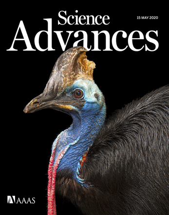

([Google Scholar](http://scholar.google.com/citations?user=IJ7DM7kAAAAJ&amp;hl=en), [Academia.edu](http://utexas.academia.edu/ChadEliason), [ResearchGate](https://www.researchgate.net/profile/Chad_Eliason))

<!-- ## Published or in press -->

### Submitted

__Eliason CM__, McCullough JM, Hackett SJ, Andersen MJ. Complex plumages spur rapid color diversification in island kingfishers (Aves: Alcedinidae). In review at _eLife_. [[doi]](https://doi.org/10.1101/2022.09.26.509475)

### 2022

<!--
__Eliason CM__, Proffitt JV, Clarke JA. Early diversification of avian limb morphology and the role of modularity in the locomotor evolution of crown birds. In revisions at _Evolution_.
__Eliason CM__, Cooper JC, Hackett SJ, Zahnle E, Pequeño Sacoe TZ, Hauber ME, Bates JM. Transgressive hybridization can accelerate the evolution of gorget color divergence in Heliodoxa hummingbirds (Aves: Trochilidae). In revisions at _Journal of the Royal Society Open Science_.
__Eliason CM__, Clarke JA, Kane SA. Wrinkle nanostructures generate diffractive blue color in great argus (\textit{Argusianus argus}) flight feathers. In revisions at _iScience_.

-->

__Eliason CM__, McCullough JM, Hains T, Andersen MJ, Shackett SJ. Genome report: Genomic novelty within a 'great speciator' revealed by a high-quality reference genome of the collared kingfisher (_Todiramphus chloris collaris_). In press at _G3: Genes, Genomes, Genetics_.

---

### 2021

Norden KK, __Eliason CM__, Stoddard MC. 2021. Evolution of brilliant iridescent feather nanostructures. _eLife_. [[doi]](https://doi.org/10.7554/eLife.71179)

__Eliason CM__, McCullough J, Andersen MJ, Hackett SJ. 2021. Accelerated brain shape evolution is associated with rapid diversification in an avian radiation. _The American Naturalist_ 197(5). [[doi]](https://doi.org/10.1086/713664)

---

### 2020

__Eliason CM__, Straker L, Jung S, Hackett SJ. Morphological innovation and biomechanical diversity in plunge-diving birds. _Evolution_ 74(7): 1514-1524. [[doi]](https://doi.org/10.1111/evo.14024)

__Eliason CM__, Clarke JA. 2020. Cassowary gloss and a novel form of structural color in birds. _Science Advances_ 6(20): eeba0187. [[doi]](https://doi.org/10.1126/sciadv.aba0187)

__Eliason CM__, Maia R, Parra JL, Shawkey MD. 2020. Signal evolution and morphological complexity in hummingbirds (Aves: Trochilidae). _Evolution_. [[doi]](https://doi.org/10.1111/evo.13893) [[pdf]]({{url}}/pdfs/hummingbirds.pdf)

---

### 2019

__Eliason CM__, Edwards SV, Clarke JA. 2019. phenotools: An r package for visualizing and analysing phenomic datasets. _Methods Ecol Evol._ 10: 1393–1400. [[doi]](https://doi.org/10.1111/2041-210X.13217) [[pdf]]({{url}}/pdfs/phenotools.pdf)

__Eliason CM__, Andersen MJ, Hackett SJ. 2019. Using historical biogeography models to understand color pattern evolution. _Systematic Biology_ 68: 755-766. [[doi]](https://doi.org/10.1093/sysbio/syz012) [[pdf]]({{url}}/pdfs/plumage.pdf)

---

### 2018

__Eliason CM__. 2018. How do complex signals evolve? _PLOS Biology_ 16(12): e3000093. [[doi]](https://doi.org/10.1371/journal.pbio.3000093)

__Eliason CM__ and Clarke JA. 2018. Metabolic physiology explains macroevolutionary trends in the melanic color system across amniotes. _Proceedings B_ 285: 20182014. [[doi]](https://doi.org/10.1098/rspb.2018.2014)

Kingsley EP, __Eliason CM__ (contributed equally), Riede T, Li Z, Hiscock TW, Farnsworth M, Thomson SL, Goller F, Tabin CJ, Clarke JA. 2018. Identity and novelty in the avian syrinx. _PNAS_ 115(41): 10209-10217. [[doi]](https://doi.org/10.1073/pnas.1804586115)

Li Z, Clarke JA, __Eliason CM__, Stidham TA, Deng T, Zhou Z. 2018. Vocal specialization through tracheal elongation in an extinct Miocene pheasant from China. _Scientific Reports_ 8(8099). [[doi]](https://doi.org/10.1038/s41598-018-26178-x)

Dongyu H, Clarke JA, __Eliason CM__, Qiu R, Li Q, Shawkey MD, Zhao C, D'Alba L, Jiang J, Xu X. 2018. A bony-crested Jurassic dinosaur with iridescent plumage highlights complexity in early paravian evolution. _Nature Communications_ 9. [[doi]](https://doi.org/10.1038/s41467-017-02515-y)

---

### 2017

__Eliason CM__, Hudson L*, Watts T*, Garza H*, Clarke JA. 2017. Exceptional preservation and the fossil record of tetrapod integument. _Proceedings of the Royal Society B_ 284: 20170556. [[doi]](http://dx.doi.org/10.1098/rspb.2017.0556) [[pdf]]({{url}}/pdfs/lagerstatten.pdf)

D'Alba L, Torres R, Waterhouse G, __Eliason CM__, Hauber M, Shawkey MD. 2017. What does the eggshell cuticle do? A functional comparison of eggshell cuticles. _Physiological and Biochemical Zoology_ 90: 588-599. [[doi]](https://doi.org/10.1086/693434)

---

### 2016

Riede T, __Eliason CM__, Miller EH, Goller F, Clarke JA. 2016. Coos, booms, and hoots: the evolution of closed-mouth vocal behavior in birds. _Evolution_ 70: 1734-1746. ___Received extensive media coverage, including The Tonight Night Show with Jimmy Fallon, Time Magazine, NPR Weekend Edition___ [[doi]](http://dx.doi.org/10.1111/evo.12988) [[pdf]]({{url}}/pdfs/coos.pdf)

Iskandar J-P*, __Eliason CM__, Astrop T, Igic B, Maia R, Shawkey MD. 2016. Morphological basis of glossy red plumage colors. _Biological Journal of the Linnaean Society_ 119: 477-487. [[doi]](http://dx.doi.org/10.1111/bij.12810) [[pdf]]({{url}}/pdfs/shiny.pdf)

__Eliason CM__, Shawkey MD, Clarke JA. 2016. Evolutionary shifts in the melanin-based color system of birds. _Evolution_ 70: 445-455. [[doi]](https://dx.doi.org/10.1111/evo.12855) [[pdf]]({{url}}/pdfs/melanin.pdf)

---

### 2015

__Eliason CM__, Maia R, Shawkey MD. 2015. Modular color evolution in ducks facilitated by a complex nanostructure. _Evolution_ 69: 357-367. [[doi]](https://dx.doi.org/10.1111/evo.12575) [[pdf]]({{url}}/pdfs/modular.pdf)

---

### 2014

__Eliason CM__, Shawkey MD. 2014. Antireflection-enhanced color by a natural graded refracting index (GRIN) structure. _Optics Express_ 22: A642-A650. ___(Highlighted in Virtual Journal of Biomedical Optics)___ [[doi]](https://doi.org/10.1364/OE.22.00A642) [[pdf]]({{url}}/pdfs/antireflection.pdf)

D'Alba LD, Jones DN, __Eliason CM__, Badawy HT, Shawkey MD. 2014. Antimicrobial properties of a nanostructured eggshell from a compost-nesting bird. _Journal of Experimental Biology_ 217: 116-1121. [[doi]](http://doi.org/10.1242/jeb.098343) [[pdf]]({{url}}/pdfs/compost.pdf)

---

### 2013

__Eliason CM__, Bitton, P-P, Shawkey MD. 2013. How hollow melanosomes affect iridescent colour production in birds. _Proceedings of the Royal Society: B_ 280: 20131505. [[doi]](http://doi.org/10.1098/rspb.2013.1505) [[pdf]]({{url}}/pdfs/hollow.pdf)

Maia R, __Eliason CM__, Bitton, P-P, Doucet SM, Shawkey MD. 2013. pavo: an R package for the analysis, visualization and organization of spectral data. _Methods in Ecology and Evolution_ 4: 906-913. [[doi]](https://doi.org/10.1111/2041-210X.12069) [[pdf]]({{url}}/pdfs/pavo.pdf)

---

### 2012

__Eliason CM__, Shawkey MD. 2012. A photonic heterostructure produces diverse iridescent colours in duck wing patches. _Journal of the Royal Society Interface_ 9(74): 2279-2289. ___(Received press coverage in Science and Spiegel Online)___ [[pdf]]({{url}}/pdfs/heterostructure.pdf) [[doi]](https://doi.org/10.1098/rsif.2012.0118)

---

### 2011

__Eliason CM__, Shawkey MD. 2011. Decreased hydrophobicity of iridescent feathers: a potential cost of shiny plumage. _Journal of Experimental Biology_ 214: 2157-2163. ___(Named as Editor's Choice for that issue of JEB, and as one of the top eight articles of the year; received press coverage in Spiegel Online, phys.org)___ [[pdf]]({{url}}/pdfs/hydrophobicity.pdf) [[doi]](https://doi.org/10.1242/jeb.055822)

Shawkey MD, D'Alba L, Wozny J, __Eliason CM__, Koop JAH, Jia L. 2011. Structural color change following hydration and dehydration of iridescent mourning dove (Zenaida macroura) feathers. _Zoology (Jena)_ 114: 59-68. [[pdf]]({{url}}/pdfs/modo.pdf) [[doi]](http://dx.doi.org/10.1016/j.zool.2010.11.001)

---

### 2010

__Eliason CM__, Shawkey MD. 2010. Rapid, reversible response of iridescent feather color to ambient humidity. _Optics Express_ 18: 21284-92. [[pdf]]({{url}}/pdfs/rapid.pdf) [[doi]](https://doi.org/10.1364/OE.18.021284)

---

### 2007

Blackledge TA, __Eliason CM__ 2007. Functionally independent components of prey capture are architecturally constrained in spider orb webs. _Biology Letters_ 3: 456-458. [[pdf]]({{url}}/pdfs/spiders.pdf) [[doi]](https://doi.org/10.1098/rsbl.2007.0218)
