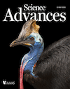

([Google Scholar](http://scholar.google.com/citations?user=IJ7DM7kAAAAJ&amp;hl=en), [Academia.edu](http://utexas.academia.edu/ChadEliason), [ResearchGate](https://www.researchgate.net/profile/Chad_Eliason))

## Forthcoming

Eliason CM, Marcondes RS, Eaton MD, Maia R, Burns KJ, Shultz AJ. Constraint and innovation in color evolution among species and among plumage patches in five avian radiations. In review. [[bioRxiv preprint]](https://doi.org/10.1101/2023.08.02.551664)

Eliason CM, Nicoläi M, Bom C, Blom E, D'Alba LD, Shawkey MD. Why are there so many colourful birds in the tropics? In review. 

## Published or in press

### 2023

Legendre LJ, Rodriguez-Saltos CA, Eliason CM, Clarke JA. Evolution of the syrinx of Apodiformes including the vocal-learning Trochilidae (Aves: Strisores). In revisions at __Zoological Journal of the Linnean Society__.

Longtine C, Eliason CM, Lee C, Mishkind D, Chiappone M, Goller F, Love J, Kingsley EP, Clarke JA, Tabin CF. Homology and the evolution of vocal folds in the novel avian voice box. In press at __Current Biology__.

Eliason CM, Mellenthin LE, Hains T, McCullough JM, Pirro S, Andersen SJ, Hackett SJ. 2023. Genomic signatures of convergent shifts to plunge-diving behavior in birds. __Communications Biology__ 6(2011). [[doi]](https://doi.org/10.1038/s42003-023-05359-z)

Eliason CM, McCullough JM, Hackett SJ, Andersen MJ. 2023. Complex plumages spur rapid color diversification in island kingfishers (Aves: Alcedinidae). __eLife__ [[doi]](https://doi.org/10.7554/eLife.83426) [[bioRxiv preprint]](https://doi.org/10.1101/2022.09.26.509475)

Eliason CM, Cooper JC, Hackett SJ, Zahnle E, Pequeño Sacoe TZ, Hauber ME, Bates JM. 2023. Interspecific hybridization explains rapid gorget color divergence in _Heliodoxa_ hummingbirds (Aves: Trochilidae). __Royal Society Open Science__. [[doi]](https://doi.org/10.1098/rsos.221603)

---

### 2022

Eliason CM, Clarke JA, Kane SA. 2022. Wrinkle nanostructures generate diffractive blue color in great argus (_Argusianus argus_) flight feathers. __iScience__. [[doi]](https://doi.org/10.1016/j.isci.2022.105912)

Eliason CM, Proffitt JV, Clarke JA. 2022. Early diversification of avian limb morphology and the role of modularity in the locomotor evolution of crown birds. __Evolution__.

Eliason CM, McCullough JM, Hains T, Andersen MJ, Shackett SJ. 2022. Genome report: Genomic novelty within a 'great speciator' revealed by a high-quality reference genome of the collared kingfisher (_Todiramphus chloris collaris_). __G3: Genes, Genomes, Genetics__. [[doi]](https://doi.org/10.1093/g3journal/jkac260)

---

### 2021

Norden KK, Eliason CM, Stoddard MC. 2021. Evolution of brilliant iridescent feather nanostructures. __eLife__. [[doi]](https://doi.org/10.7554/eLife.71179)

Eliason CM, McCullough J, Andersen MJ, Hackett SJ. 2021. Accelerated brain shape evolution is associated with rapid diversification in an avian radiation. __The American Naturalist__ 197(5). [[doi]](https://doi.org/10.1086/713664)

---

### 2020

Eliason CM, Straker L, Jung S, Hackett SJ. Morphological innovation and biomechanical diversity in plunge-diving birds. __Evolution__ 74(7): 1514-1524. [[doi]](https://doi.org/10.1111/evo.14024)

Eliason CM, Clarke JA. 2020. Cassowary gloss and a novel form of structural color in birds. __Science Advances__ 6(20): eeba0187. [[doi]](https://doi.org/10.1126/sciadv.aba0187)

Eliason CM, Maia R, Parra JL, Shawkey MD. 2020. Signal evolution and morphological complexity in hummingbirds (Aves: Trochilidae). __Evolution__. [[doi]](https://doi.org/10.1111/evo.13893) [[pdf]]({{url}}/pdfs/hummingbirds.pdf)

---

### 2019

Eliason CM, Edwards SV, Clarke JA. 2019. phenotools: An r package for visualizing and analysing phenomic datasets. __Methods in Ecology and Evolution__ 10: 1393–1400. [[doi]](https://doi.org/10.1111/2041-210X.13217) [[pdf]]({{url}}/pdfs/phenotools.pdf)

Eliason CM, Andersen MJ, Hackett SJ. 2019. Using historical biogeography models to understand color pattern evolution. __Systematic Biology__ 68: 755-766. [[doi]](https://doi.org/10.1093/sysbio/syz012) [[pdf]]({{url}}/pdfs/plumage.pdf)

---

### 2018

Eliason CM. 2018. How do complex signals evolve? __PLOS Biology__ 16(12): e3000093. [[doi]](https://doi.org/10.1371/journal.pbio.3000093)

Eliason CM and Clarke JA. 2018. Metabolic physiology explains macroevolutionary trends in the melanic color system across amniotes. __Proceedings of the Royal Society B__ 285: 20182014. [[doi]](https://doi.org/10.1098/rspb.2018.2014)

Kingsley EP, Eliason CM (contributed equally), Riede T, Li Z, Hiscock TW, Farnsworth M, Thomson SL, Goller F, Tabin CJ, Clarke JA. 2018. Identity and novelty in the avian syrinx. __PNAS__ 115(41): 10209-10217. [[doi]](https://doi.org/10.1073/pnas.1804586115)

Li Z, Clarke JA, Eliason CM, Stidham TA, Deng T, Zhou Z. 2018. Vocal specialization through tracheal elongation in an extinct Miocene pheasant from China. __Scientific Reports__ 8(8099). [[doi]](https://doi.org/10.1038/s41598-018-26178-x)

Dongyu H, Clarke JA, Eliason CM, Qiu R, Li Q, Shawkey MD, Zhao C, D'Alba L, Jiang J, Xu X. 2018. A bony-crested Jurassic dinosaur with iridescent plumage highlights complexity in early paravian evolution. __Nature Communications__ 9. [[doi]](https://doi.org/10.1038/s41467-017-02515-y)

---

### 2017

Eliason CM, Hudson L*, Watts T*, Garza H*, Clarke JA. 2017. Exceptional preservation and the fossil record of tetrapod integument. __Proceedings of the Royal Society B__ 284: 20170556. [[doi]](http://dx.doi.org/10.1098/rspb.2017.0556) [[pdf]]({{url}}/pdfs/lagerstatten.pdf)

D'Alba L, Torres R, Waterhouse G, Eliason CM, Hauber M, Shawkey MD. 2017. What does the eggshell cuticle do? A functional comparison of eggshell cuticles. __Physiological and Biochemical Zoology__ 90: 588-599. [[doi]](https://doi.org/10.1086/693434)

---

### 2016

Riede T, Eliason CM, Miller EH, Goller F, Clarke JA. 2016. Coos, booms, and hoots: the evolution of closed-mouth vocal behavior in birds. __Evolution__ 70: 1734-1746. ___Received extensive media coverage, including The Tonight Night Show with Jimmy Fallon, Time Magazine, NPR Weekend Edition___ [[doi]](http://dx.doi.org/10.1111/evo.12988) [[pdf]]({{url}}/pdfs/coos.pdf)

Iskandar J-P*, Eliason CM, Astrop T, Igic B, Maia R, Shawkey MD. 2016. Morphological basis of glossy red plumage colors. __Biological Journal of the Linnaean Society__ 119: 477-487. [[doi]](http://dx.doi.org/10.1111/bij.12810) [[pdf]]({{url}}/pdfs/shiny.pdf)

Eliason CM, Shawkey MD, Clarke JA. 2016. Evolutionary shifts in the melanin-based color system of birds. __Evolution__ 70: 445-455. [[doi]](https://dx.doi.org/10.1111/evo.12855) [[pdf]]({{url}}/pdfs/melanin.pdf)

---

### 2015

Eliason CM, Maia R, Shawkey MD. 2015. Modular color evolution in ducks facilitated by a complex nanostructure. __Evolution__ 69: 357-367. [[doi]](https://dx.doi.org/10.1111/evo.12575) [[pdf]]({{url}}/pdfs/modular.pdf)

---

### 2014

Eliason CM, Shawkey MD. 2014. Antireflection-enhanced color by a natural graded refracting index (GRIN) structure. __Optics Express__ 22: A642-A650. ___(Highlighted in Virtual Journal of Biomedical Optics)___ [[doi]](https://doi.org/10.1364/OE.22.00A642) [[pdf]]({{url}}/pdfs/antireflection.pdf)

D'Alba LD, Jones DN, Eliason CM, Badawy HT, Shawkey MD. 2014. Antimicrobial properties of a nanostructured eggshell from a compost-nesting bird. __Journal of Experimental Biology__ 217: 116-1121. [[doi]](http://doi.org/10.1242/jeb.098343) [[pdf]]({{url}}/pdfs/compost.pdf)

---

### 2013

Eliason CM, Bitton, P-P, Shawkey MD. 2013. How hollow melanosomes affect iridescent colour production in birds. __Proceedings of the Royal Society B__ 280: 20131505. [[doi]](http://doi.org/10.1098/rspb.2013.1505) [[pdf]]({{url}}/pdfs/hollow.pdf)

Maia R, Eliason CM, Bitton, P-P, Doucet SM, Shawkey MD. 2013. pavo: an R package for the analysis, visualization and organization of spectral data. __Methods in Ecology and Evolution__ 4: 906-913. [[doi]](https://doi.org/10.1111/2041-210X.12069) [[pdf]]({{url}}/pdfs/pavo.pdf)

---

### 2012

Eliason CM, Shawkey MD. 2012. A photonic heterostructure produces diverse iridescent colours in duck wing patches. __Journal of the Royal Society Interface__ 9(74): 2279-2289. ___(Received press coverage in Science and Spiegel Online)___ [[pdf]]({{url}}/pdfs/heterostructure.pdf) [[doi]](https://doi.org/10.1098/rsif.2012.0118)

---

### 2011

Eliason CM, Shawkey MD. 2011. Decreased hydrophobicity of iridescent feathers: a potential cost of shiny plumage. __Journal of Experimental Biology__ 214: 2157-2163. ___(Named as Editor's Choice for that issue of JEB, and as one of the top eight articles of the year; received press coverage in Spiegel Online, phys.org)___ [[pdf]]({{url}}/pdfs/hydrophobicity.pdf) [[doi]](https://doi.org/10.1242/jeb.055822)

Shawkey MD, D'Alba L, Wozny J, Eliason CM, Koop JAH, Jia L. 2011. Structural color change following hydration and dehydration of iridescent mourning dove (_Zenaida macroura_) feathers. __Zoology (Jena)__ 114: 59-68. [[pdf]]({{url}}/pdfs/modo.pdf) [[doi]](http://dx.doi.org/10.1016/j.zool.2010.11.001)

---

### 2010

Eliason CM, Shawkey MD. 2010. Rapid, reversible response of iridescent feather color to ambient humidity. __Optics Express__ 18: 21284-92. [[pdf]]({{url}}/pdfs/rapid.pdf) [[doi]](https://doi.org/10.1364/OE.18.021284)

---

### 2007

Blackledge TA, Eliason CM 2007. Functionally independent components of prey capture are architecturally constrained in spider orb webs. __Biology Letters__ 3: 456-458. [[pdf]]({{url}}/pdfs/spiders.pdf) [[doi]](https://doi.org/10.1098/rsbl.2007.0218)
