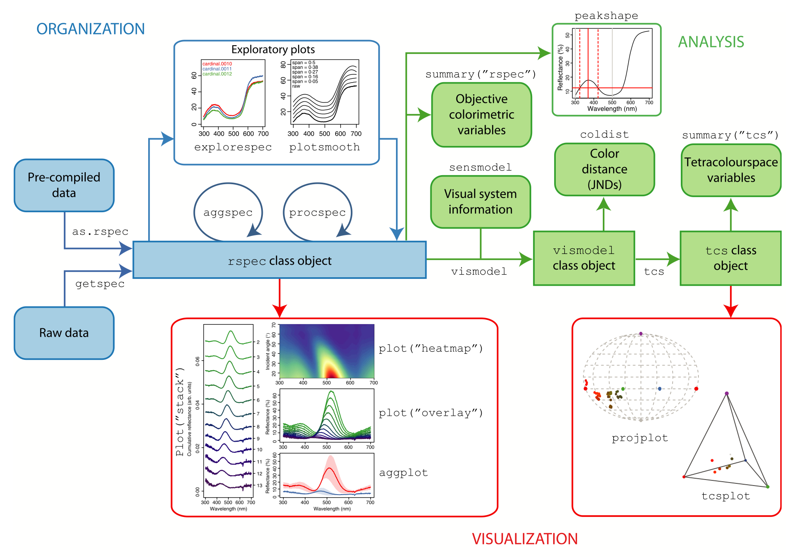
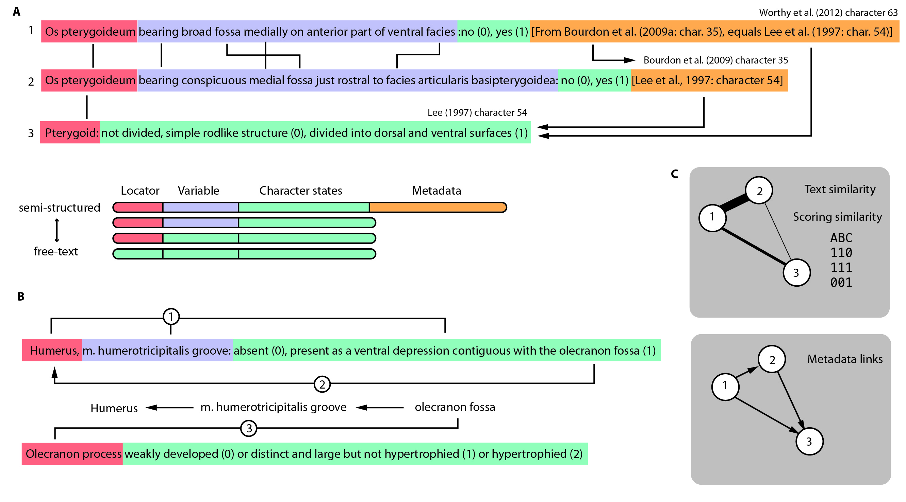

## pavo

`pavo` is an R package that provides a cohesive framework for handling spectral data and addressing complex questions in sensory ecology, while at the same time combining with `R`'s modular core for comprehensive analysis.

[[article pdf]](https://besjournals.onlinelibrary.wiley.com/doi/pdfdirect/10.1111/2041-210X.12069)
[[article doi]](https://doi.org/10.1111/2041-210X.12069)
[[github]](https://github.com/rmaia/pavo)
[[package]](https://cran.r-project.org/web/packages/pavo/index.html)

## phenotools

phenotools provides functionality for inputting phenomic data sets; merging data sets into a single phenomic data set based on a common set of taxa; annotating characters based on fuzzy text searching/trait ontologies (see image below); filtering overlapping phenomic characters and taxa (e.g. merging taxa into supraspecific terminals); visualizing similarities in character description; and outputting phenomic data sets to common phylogenetic data formats for downstream analysis.

[[article doi]](https://doi.org/10.1111/2041-210X.13217)
[[package]](https://zenodo.org/record/2654974)

<!-- ## Other code -->

## football

<iframe src="bumpchart.html" width="800" height="400"></iframe>
